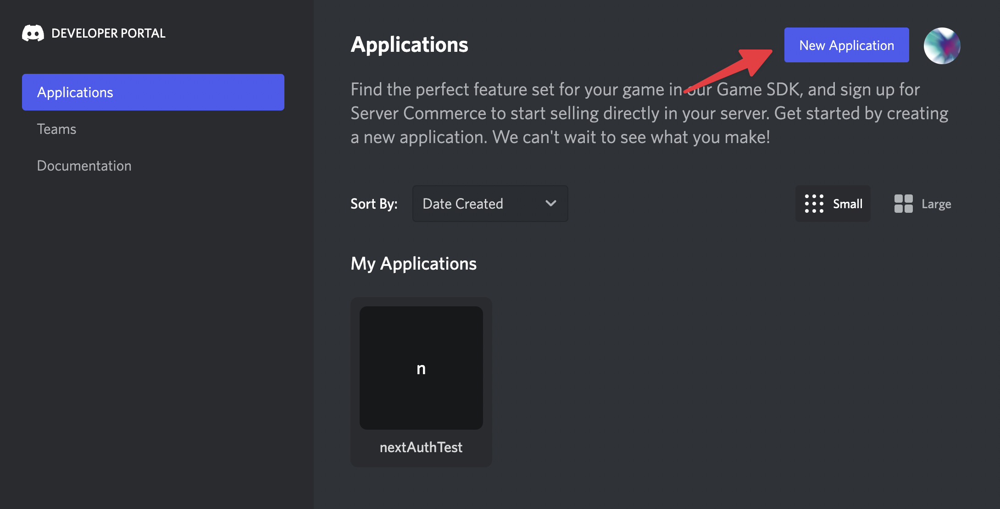
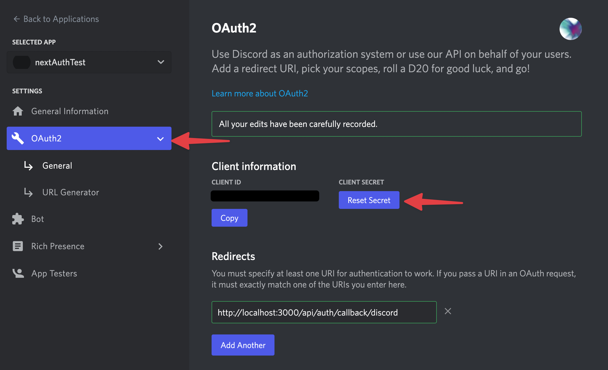

## ToDoアプリの作り方

`create-t3-app`をした後、単純なToDoを作成できるところまでの解説をします。

**\* サーバーへのデプロイにはMySQLなどのデータベースを別途用意する必要である場合があるためここでは解説しません**。

### 1 NextAuthでログイン機能を実装

プロジェクトを作成した時点でDiscordを利用したログイン機能が実装されているので、必要な情報を追加してログインをしてみます。

#### 1-1 DISCORD DEVELOPER PORTAL から `CLIENT ID` と `CLIENT SECRET` の発行

まずは[DEVELOPER PORTAL](https://discord.com/developers/applications)にアクセスしログインをします。

ログインできたら`New Application`からアプリを作成します。



メニューの`OAuth2`に入り、`CLIENT SECRET`を生成します。

`Redirects`のインプットに`http://localhost:3000/api/auth/callback/discord`を記入して保存します。



ここで取得した `CLIENT ID` と `CLIENT SECRET`を使って`.env`ファイルを下記のように変更してください。

```
# Note that not all variables here might be in use for your selected configuration
# When adding additional env variables, the schema in /env/schema.mjs should be updated accordingly

# Prisma
DATABASE_URL=file:./db.sqlite

# Next Auth
NEXTAUTH_SECRET=local
NEXTAUTH_URL=http://localhost:3000

# Next Auth Discord Provider
DISCORD_CLIENT_ID=取得したCLIENT IDを記入
DISCORD_CLIENT_SECRET=取得したCLIENT SECRETを記入
```

#### 1-2 サインイン機能の実装

`/src/pages/index.tsx`ファイルを開きsignIn関数をimportします。

```
import { signIn } from "next-auth/react";
```

続いてサインイン用のボタンを追加

```
<button onClick={() => signIn()}>signIn</button>
```

### 2 PrismaにToDo用のスキーマを定義

#### 2-1 ToDoモデルを作成

`/prisma/schema.prisma`ファイルを開き下記のようにモデルを追加します。

```
model Todo {
    id            String    @id @default(cuid())
    userId        String
    status        String
    content       String
    createdAt     DateTime
    user          User     @relation(fields: [userId], references: [id], onDelete: Cascade)
}
```

次に`User`モデルに1行追加します。

```
model User {
    id            String    @id @default(cuid())
    name          String?
    email         String?   @unique
    emailVerified DateTime?
    image         String?
    accounts      Account[]
    sessions      Session[]
    todos         Todo[] // この行を追加
}
```

#### 2-2 ToDoモデルをデータベースに反映

`npx prisma db push`コマンドを実行したらデータベースへの反映が完了です。

反映の確認は`npx prisma studio`を実行するとブラウザ上から確認することができます。

### 3 tRPCでAPIの作成

#### 3-1 ルーターの作成

`/src/server/router/todo.ts`ファイルを作成し下記のように記述

```js
import { createRouter } from "./context";
import { z } from "zod";

export const todoRouter = createRouter()
  .mutation("create", {
    input: z
      .object({
        // incomplete / complete
        status: z.string(),
        content: z.string(),
        userId: z.string(),
      })
      .required(),
    async resolve({ ctx, input }) {
      return await ctx.prisma.todo.create({
        data: { ...input, createdAt: new Date() },
      });
    },
  })
  .query("getAll", {
    async resolve({ ctx }) {
      return await ctx.prisma.todo.findMany();
    },
  });
```

次に`/src/server/router/index.ts`ファイルで先ほど作成したルーターのマージをします。

```js
import { createRouter } from "./context";
import superjson from "superjson";

import { exampleRouter } from "./example";
import { todoRouter } from "./todo";
import { protectedExampleRouter } from "./protected-example-router";

export const appRouter = createRouter()
  .transformer(superjson)
  .merge("example.", exampleRouter)
  .merge("todo.", todoRouter) // この行を追加
  .merge("auth.", protectedExampleRouter);

// export type definition of API
export type AppRouter = typeof appRouter;
```

### 4 ToDoの表示・作成部分の追加

#### 4-1 作成部分の追加

`/src/pages/index.tsx`ファイルへ下記のようにコードを追加します

関数部分

```js
import { useCallback, useState } from "react";

...

const [content, setContent] = useState("");
const auth = trpc.useQuery(["auth.getSession"]);
const todo = trpc.useQuery(["todo.getAll"]);
const create = trpc.useMutation(["todo.create"]);

const onCreateTodo = useCallback(() => {
  if (!auth.data) return;
  create.mutate(
    {
      userId: auth.data.user.id,
      status: "incomplete",
      content,
    },
    {
      onSuccess: () => {
        setContent("");
        todo.refetch();
      },
    }
  );
}, [content, todo, create, auth]);
```

見た目部分

```js
{auth.data && (
  <div>
    <h3>Create</h3>
    <form
      onSubmit={(e) => {
        e.preventDefault();
        onCreateTodo();
      }}
      className="flex flex-col w-full"
    >
      <textarea
        value={content}
        onChange={(e) => setContent(e.target.value)}
        className="w-full border p-4 h-56"
      ></textarea>
      <button type="submit">Create</button>
    </form>
  </div>
)}
```

サインインしてある状態であればこの時点でToDoの作成ができます。

#### 4-2 一覧表示部分

データの取得部分は先ほど追記したコードを使い回します。

```
const todo = trpc.useQuery(["todo.getAll"]);
```

見た目部分

```
{todo.data && (
  <ul className="space-y-4">
    {!!todo.data.length && <li>TODOS</li>}
    {todo.data.map((item) => (
      <li key={item.id}>
        <h4>{item.content}</h4>
        <p>{`createdAt: ${item.createdAt}`}</p>
      </li>
    ))}
  </ul>
)}
```